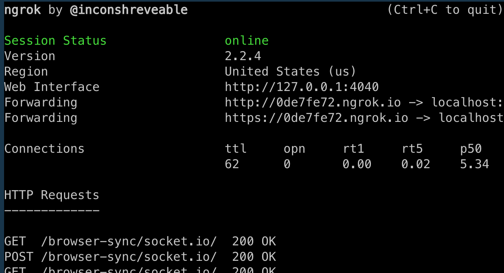

## Website Performance Optimization portfolio project


## Getting started


1. **Clone the repo**

  ```
  $ git clone https://github.com/ajames20/fend_optimize.git
  cd into repo
  ```
3. **Install Ngrok globally**

  ```
  $ npm install ngrok -g
  ```

2. **Install dependencies**

  ```
  $ npm install or yarn
  ```

4. **Run Build Task**

  ```
  $ gulp
  ```
  note: the default gulp task is serving the web pages from the optimized build directory 'dist' (not from the 'src' directory').


4. **Run ngrok**

  ```
  $ ngrok http 3000
  ```
  note: when you run ngrok you will be given a forwarding web address to use with page speed index website.
  

  You can use the link provided with the [google page speed insight website](https://developers.google.com/speed/pagespeed/insights/)
  

## Objectives 

1. `index.html` meets a page speed index of 90 or higher
1. `views/pizza.html` meets 60fps and time to resize pizzas is less than 5ms.

#### Optimization Speed Index of 90 or higher

1. Added `media="print"` to print css link.
1. Set up gulp for the first time.
1. Added a gulp script to inline/minify html and css.
1. Added `async` to the google analytics script tag.
1. Added uglify for JS files.
1. Added image compression with gulp. 
1. Used ngrok cli to test page speed.

#### Optimization to meet 60fps Implementation

1. Removed pointless `determineDx` function in `main.js`
1. Updated `changePizzaSizes` function so that it handled resizing of pizzas.
1. Updated `style.css` with `will-change: transfrom:` property on the `.mover` class.
1. Added `window.frame++` to the `updatePositions` function.
1. Added `newPostion` array to hold the calculations made.
1. Looped over `items` array and adjusted the adjusted `items.style.left` to the new position at the `i-th` position form the the new position array.
